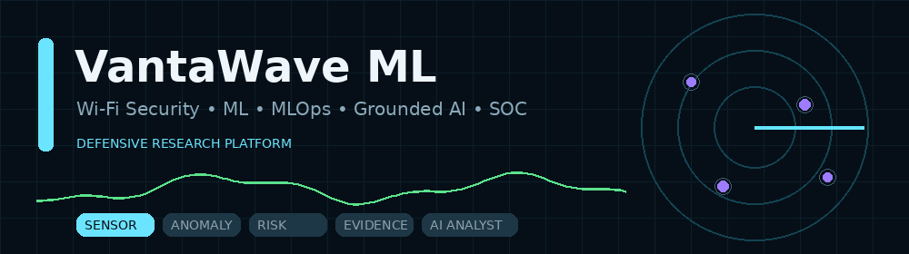
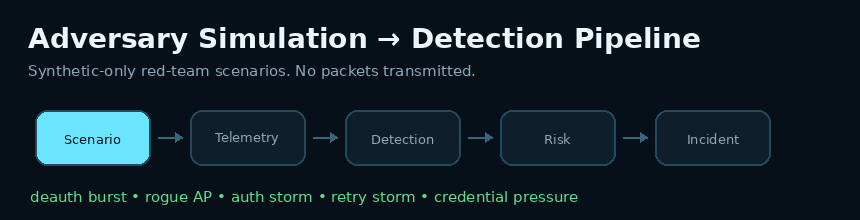
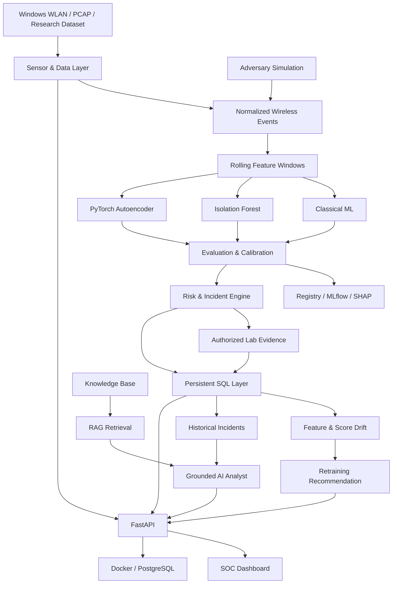

<div align="center">



# VantaWave ML

### Wi‑Fi Security Research • Machine Learning • MLOps • Grounded AI • SOC

[](RELEASE_NOTES.md)
[](pyproject.toml)
[](src/vantawave/api)
[](src/vantawave/ml/deep)
[](tests)
[](https://github.com/ViolettaNcl/vantawave-ml/actions)
[](https://github.com/ViolettaNcl/vantawave-ml/actions)

**An end-to-end defensive Wi‑Fi security platform built as a production-grade ML engineering portfolio project.**

[Dashboard](#-soc-dashboard) · [Architecture](#-architecture) · [Quick Start](#-quick-start) · [Adversary Simulation](#-adversary-simulation) · [ML/MLOps](#-ml--mlops) · [Security Scope](#-security-scope) · [Русская версия](README_RU.md)

</div>

---

## ✦ Why VantaWave

Most ML portfolio projects stop at a notebook and an accuracy score.

**VantaWave does not.**

It connects the full lifecycle:

```text
Wi‑Fi / PCAP / Research Data
          ↓
Data Validation & Feature Engineering
          ↓
Classical ML + Deep Anomaly Detection
          ↓
Threshold Calibration & Error Analysis
          ↓
Model Registry / MLflow / Explainability
          ↓
Risk & Incident Engine
          ↓
Persistent Monitoring & Drift
          ↓
Authorized Lab Evidence
          ↓
Grounded RAG Security Analyst
          ↓
FastAPI + SOC Dashboard
          ↓
Docker / PostgreSQL Production Runtime
```

The project is intentionally designed around **engineering boundaries, reproducibility, evidence, and honest evaluation** rather than demo-only metrics.

---

## ✦ Product Surface

| Area | What it does | Status |
|---|---|---:|
| **SOC Dashboard** | Overview, live monitor, incidents, models, lab, drift, AI | ✅ |
| **Passive Wi‑Fi Sensor** | Windows WLAN discovery + normalized events | ✅ |
| **PCAP Replay** | Offline 802.11 capture analysis | ✅ |
| **Authorized Lab** | Target registry, sessions, evidence, reports | ✅ |
| **Capture Audit** | Target-bound EAPOL evidence + single-candidate verification | ✅ |
| **Adversary Simulation** | Safe synthetic red-team scenarios | ✅ |
| **Classical ML** | Logistic Regression, Random Forest, HistGradientBoosting | ✅ |
| **Deep Anomaly Detection** | PyTorch Autoencoder + Isolation Forest baseline | ✅ |
| **MLOps** | Registry, MLflow, promotion, SHAP, experiment history | ✅ |
| **Monitoring** | Feature drift, score drift, retraining recommendations | ✅ |
| **Grounded AI Analyst** | Evidence-first RAG with citations | ✅ |
| **Production Runtime** | FastAPI, Docker, Compose, PostgreSQL, readiness | ✅ |

---

## ✦ SOC Dashboard

Run:

```powershell
python -m uvicorn vantawave.api.main:app --reload
```

Open:

```text
http://127.0.0.1:8000/dashboard
```

Dashboard modules:

```text
Overview
├── Runtime readiness
├── ML capabilities
├── Drift summary
└── Authorized targets

Live Monitor
├── Sensor capabilities
└── Windows WLAN discovery

Wi‑Fi Recovery
├── Saved profile inventory
├── Nearby Wi‑Fi
├── Gateway discovery
├── Password-strength audit
└── Connect with owner-supplied password

Capture Audit
├── Authorized target
├── PCAP / PCAPNG / CAP
├── EAPOL evidence
├── Aircrack-ng capability
└── Single-candidate verification

Adversary Simulation
├── Deauthentication burst
├── Rogue AP presence
├── Authentication storm
├── Retry storm
└── Credential-pressure simulation

Incidents / Models / Experiments / Monitoring / AI Analyst
```

---

## ✦ Adversary Simulation



VantaWave includes a **safe red-team simulation layer**. It generates synthetic telemetry and sends it through the defensive pipeline.

No packets are transmitted.

No passwords are tested.

No external Wi‑Fi network is attacked.

### Included scenarios

| Scenario | Defensive signal |
|---|---|
| **Deauthentication burst** | deauth rate / management-frame spike |
| **Rogue AP presence** | unexpected BSSID / duplicate SSID topology |
| **Authentication storm** | auth-rate and transmitter-count spike |
| **Retry storm** | retry ratio / RSSI variation |
| **Credential pressure** | repeated rejected-auth pattern, without testing real credentials |

Run from CLI:

```powershell
python scripts/run_adversary_simulation.py --list
```

Example:

```powershell
python scripts/run_adversary_simulation.py deauth_burst --intensity 4
```

Every run produces:

- baseline telemetry;
- scenario telemetry;
- feature deltas;
- anomaly score;
- classifier confidence;
- risk score;
- triggered detections;
- timeline;
- JSON + Markdown report.

---

## ✦ Architecture



Detailed architecture: [`docs/final_architecture.md`](docs/final_architecture.md)

---

## ✦ Quick Start

### 1. Clone

```powershell
git clone https://github.com/ViolettaNcl/vantawave-ml.git
cd vantawave-ml
```

### 2. Create environment

```powershell
py -m venv .venv
.\.venv\Scripts\Activate.ps1
```

### 3. Install

```powershell
python -m pip install --upgrade pip
python -m pip install -e ".[dev,deep,pcap]"
```

### 4. Verify

```powershell
python -m pytest
python scripts/final_portfolio_check.py
```

### 5. Seed the portfolio demo

```powershell
python scripts/seed_portfolio_demo.py
python scripts/build_knowledge_index.py docs
```

### 6. Launch

```powershell
python -m uvicorn vantawave.api.main:app --reload
```

Open:

- Dashboard → `http://127.0.0.1:8000/dashboard`
- Swagger → `http://127.0.0.1:8000/docs`
- Readiness → `http://127.0.0.1:8000/ready`

---

## ✦ ML & MLOps

### Supervised models

- Logistic Regression
- Random Forest
- Histogram Gradient Boosting
- optional CatBoost

### Anomaly detection

- Isolation Forest
- PyTorch Autoencoder
- normal-only Autoencoder training
- validation-normal reconstruction threshold
- known / unknown attack evaluation

### Evaluation

- Precision
- Recall
- F1
- PR-AUC
- ROC-AUC
- False Positive Rate
- False Negative Rate
- Confusion Matrix
- Inference latency
- Threshold calibration
- Error analysis

### Explainability

- Permutation importance
- optional SHAP `TreeExplainer`

### Model lifecycle

```text
Train
→ Validate
→ Calibrate
→ Test
→ Error Analysis
→ Promotion Policy
→ Candidate / Champion
→ Monitor
→ Drift
→ Retraining Recommendation
```

---

## ✦ Research Integrity

VantaWave contains synthetic fixtures so the entire pipeline can be reproduced without private data.

Synthetic metrics are **not** presented as real-world Wi‑Fi IDS performance.

Before publishing real detection claims:

```text
Real external dataset
      +
Authorized local telemetry
      ↓
Domain-matched held-out evaluation
      ↓
Threshold calibration
      ↓
Error analysis
      ↓
Final evidence-backed metrics
```

See [`FINAL_VALIDATION.md`](FINAL_VALIDATION.md).

---

## ✦ Passive Wi‑Fi Telemetry

Windows capability check:

```powershell
python scripts/sensor_capabilities.py
```

One scan:

```powershell
python scripts/scan_wifi.py --once
```

Session:

```powershell
python scripts/scan_wifi.py --duration 60 --interval 5 --window 60
```

VantaWave records collection provenance so OS-level discovery is never mislabeled as raw monitor-mode capture.

---

## ✦ Authorized Capture Audit

Capture Audit follows an evidence-based WPA/WPA2 workflow:

```text
Authorized Target
→ Capture
→ Target/EAPOL Evidence
→ One Owner-Supplied Candidate
→ Verify
→ Mask
→ Connect Verified
```

The integration deliberately exposes **no wordlist or brute-force API**.

Requirements:

```powershell
python -m pip install -e ".[pcap]"
```

Optional Aircrack-ng path:

```powershell
$env:VANTAWAVE_AIRCRACK_PATH="C:\Tools\aircrack-ng\aircrack-ng.exe"
```

Documentation: [`docs/authorized_capture_audit.md`](docs/authorized_capture_audit.md)

---

## ✦ Grounded AI Security Analyst

The LLM is **not the detector**.

The analyst consumes:

1. persisted incident evidence;
2. historical incident records;
3. retrieved project knowledge.

Each concrete claim must use a valid evidence citation.

Example citation types:

```text
[incident:abc123]
[evidence:abc123]
[document-id-0001]
```

The restricted agent planner is read-only and defensive.

Allowed:

```text
summarize incident
retrieve knowledge
compare history
suggest defensive checks
generate report
```

Not exposed:

```text
packet injection
credential theft
brute force
exploit execution
third-party targeting
```

---

## ✦ Persistent Data Platform

VantaWave persists:

- authorized targets;
- sensor sessions;
- incidents;
- drift events;
- model snapshots;
- evaluation runs.

Local development:

```text
SQLite
```

Production:

```text
PostgreSQL + Psycopg 3
```

Schema changes use Alembic:

```powershell
alembic upgrade head
```

---

## ✦ Production

```powershell
Copy-Item .env.example .env
docker compose config
docker compose up --build
```

Production stack includes:

- non-root API container;
- PostgreSQL;
- Alembic migrations before startup;
- JSON structured logging;
- health/readiness checks;
- dependency audit;
- static security scan.

---

## ✦ Repository Map

```text
vantawave-ml/
├── src/vantawave/
│   ├── ai/                 # RAG + grounded analyst
│   ├── api/                # FastAPI routes
│   ├── capture_audit/      # authorized capture evidence
│   ├── data/               # loaders / validation / AWID3 adapter
│   ├── db/                 # SQLAlchemy persistence
│   ├── experiments/        # experiment history
│   ├── lab/                # authorized targets / evidence
│   ├── ml/                 # classical + deep ML
│   ├── monitoring/         # drift / evaluation policy
│   ├── registry/           # model registry
│   ├── risk/               # transparent risk engine
│   ├── sensors/            # Wi-Fi telemetry / replay
│   ├── simulation/         # safe adversary scenarios
│   ├── web/                # SOC dashboard
│   └── wifi_recovery/      # local Windows recovery tools
├── alembic/                # database migrations
├── docs/                   # architecture / research / operations
├── scripts/                # reproducible workflows
├── tests/                  # automated test suite
├── Dockerfile
├── docker-compose.yml
├── FINAL_VALIDATION.md
├── INTERVIEW_DEFENSE.md
└── RELEASE_NOTES.md
```

---

## ✦ Security Scope

VantaWave is built for:

- defensive security research;
- explicitly authorized lab targets;
- public research datasets under their terms;
- offline captures the operator is authorized to analyze;
- synthetic adversary simulation.

It does **not** claim to reveal an unknown WPA2/WPA3 password from an SSID alone.

It does **not** expose active black-hat automation.

See [`SECURITY.md`](SECURITY.md).

---

## ✦ Engineering Principles

```text
Evidence over assumptions
Reproducibility over screenshots
Held-out evaluation over optimistic metrics
Explicit authorization over implicit targeting
Model lifecycle over one-off notebooks
Grounded AI over hallucinated security claims
```

---

## ✦ Portfolio / Interview

Recommended files:

- [`INTERVIEW_DEFENSE.md`](INTERVIEW_DEFENSE.md)
- [`FINAL_VALIDATION.md`](FINAL_VALIDATION.md)
- [`docs/demo_walkthrough.md`](docs/demo_walkthrough.md)
- [`docs/final_architecture.md`](docs/final_architecture.md)
- [`docs/adversary_simulation.md`](docs/adversary_simulation.md)

### 30-second project pitch

> VantaWave ML is an end-to-end Wi‑Fi security ML platform. I built the pipeline from telemetry normalization and leakage-safe model evaluation through deep anomaly detection, MLOps, persistent monitoring, authorized lab evidence, a grounded RAG analyst, safe red-team simulation, and a production SOC dashboard.

---

<div align="center">

### VantaWave ML · v1.1.0

**Defensive wireless research with production ML engineering discipline.**

`Python` · `FastAPI` · `scikit-learn` · `PyTorch` · `MLflow` · `SHAP` · `SQLAlchemy` · `PostgreSQL` · `Docker`

</div>
