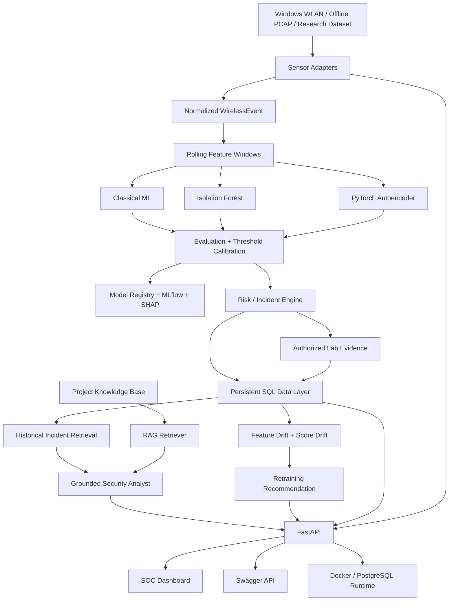

# VantaWave ML v1.0 — Final Architecture

## Layer boundaries

### Collection
Hardware/OS-specific sensor code emits normalized events.

### Feature engineering
Time-window aggregation transforms events into measurable features.

### ML
Supervised models and anomaly models remain independent from sensor drivers.

### Evaluation
Threshold selection, model promotion, error analysis, explainability and
registry logic are explicit and auditable.

### Persistence
SQLAlchemy models store targets, sessions, incidents, drift, model snapshots
and evaluation history.

### AI
The Security Analyst reads persisted evidence plus retrieved documentation.
It does not generate source evidence itself.

### UI
The dashboard consumes public API endpoints. It does not contain duplicate ML
or database business logic.
