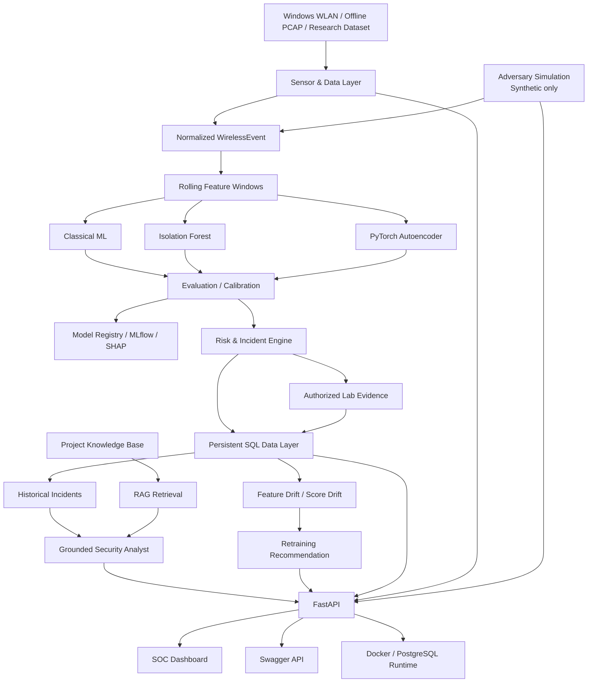

# VantaWave ML v1.1 — Final Architecture

## 1. Collection layer

Hardware/OS-specific code is isolated behind sensor adapters.

Current collection modes:

- Windows OS-visible WLAN discovery;
- normalized JSONL replay;
- offline PCAP/PCAPNG replay.

Collection provenance is stored explicitly so OS discovery is never presented
as monitor-mode raw capture.

## 2. Normalized event model

Sensors emit `WirelessEvent` records containing fields such as:

- event type;
- timestamp;
- source;
- SSID/BSSID;
- transmitter/receiver;
- channel/frequency;
- signal/RSSI;
- retry flag;
- security metadata.

This prevents ML code from depending directly on a hardware-specific parser.

## 3. Feature layer

Events are aggregated into rolling windows.

Examples:

- event rate;
- authentication rate;
- deauthentication rate;
- unique BSSIDs/transmitters;
- RSSI mean/std;
- retry ratio;
- channel count.

## 4. ML layer

### Supervised

- Logistic Regression
- Random Forest
- Histogram Gradient Boosting
- optional CatBoost

### Anomaly detection

- Isolation Forest
- PyTorch Autoencoder

The Autoencoder is trained on normal-only data and uses a validation-normal
reconstruction-error threshold.

## 5. Evaluation / MLOps

The model lifecycle contains:

- train/validation/test split;
- threshold calibration;
- held-out test evaluation;
- error analysis;
- model promotion policy;
- local model registry;
- optional MLflow;
- SHAP/permutation explainability.

## 6. Risk / incidents

Detector outputs are converted into transparent risk components:

- anomaly score;
- classifier confidence;
- repeated alerts;
- unknown-device evidence.

Incidents persist evidence rather than only a final label.

## 7. Authorized Lab

Security experiments are bound to explicitly registered targets.

Lab artifacts include:

- target IDs;
- sessions;
- before/after feature windows;
- SHA-256 evidence bundles;
- incident reports.

## 8. Capture Audit

The capture-audit layer:

- requires an Authorized Lab target;
- analyzes local PCAP/PCAPNG/CAP files;
- checks target SSID/BSSID evidence;
- inspects EAPOL presence;
- optionally verifies one WPA2 candidate through Aircrack-ng.

The application exposes no wordlist/brute-force API.

## 9. Adversary Simulation

The simulation layer is intentionally **synthetic only**.

It creates controlled event streams for:

- deauthentication bursts;
- duplicate/rogue BSSID topology;
- authentication storms;
- retry-heavy radio behavior;
- credential-pressure telemetry.

Those events enter the same normalized-event → feature → risk path as other
data sources.

This gives a safe red-team/blue-team demonstration without transmitting
packets or targeting a real network.

## 10. Persistence / monitoring

SQLAlchemy stores:

- targets;
- sessions;
- incidents;
- drift events;
- model snapshots;
- evaluation runs.

Monitoring compares current distributions against baselines and records
retraining recommendations with explicit reasons.

## 11. Grounded AI

The Security Analyst receives:

- persisted incident evidence;
- historical incidents;
- retrieved documentation.

Concrete claims are tied to evidence citations.

The LLM is not the source of detection truth.

## 12. API / SOC

FastAPI exposes the platform to:

- the built-in SOC dashboard;
- Swagger/OpenAPI;
- production service integrations.

The dashboard contains:

- Overview;
- Live Monitor;
- Wi-Fi Recovery;
- Capture Audit;
- Adversary Simulation;
- Incidents;
- Models;
- Experiments;
- Authorized Lab;
- Monitoring;
- AI Analyst.

## 13. Production

Production engineering includes:

- environment configuration;
- structured JSON logging;
- liveness/readiness separation;
- Docker;
- Docker Compose;
- PostgreSQL;
- Alembic;
- non-root runtime;
- dependency/static security scanning.
